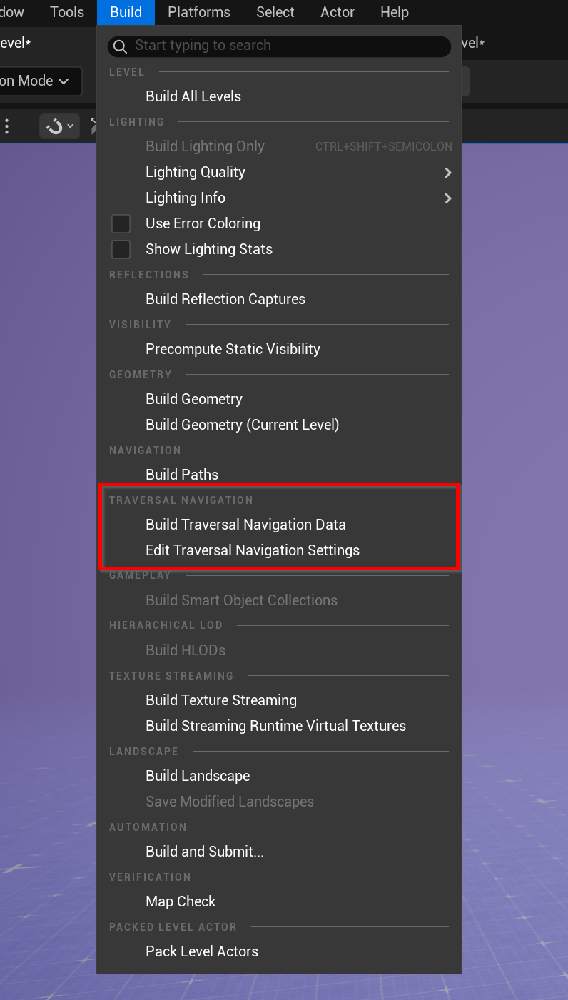
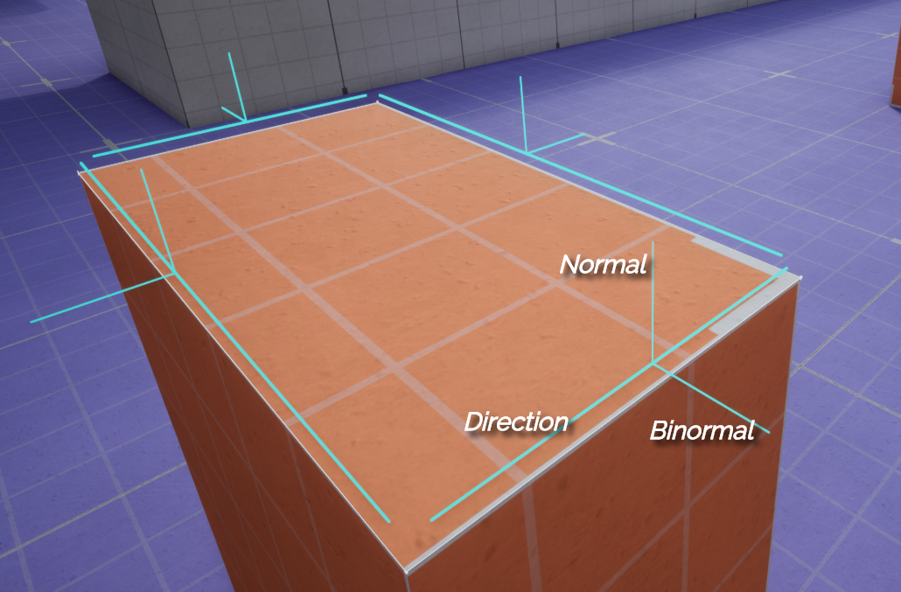

# Traversal Navigation Data Plugin


---
* This plugin provides a solution for baking, querying, and using traversal navigation segment data generated from the NavMesh. It is designed to support traversal gameplay features such as ledge grabs, vaults, and other navigation-based traversal actions.
These segments can be queried at runtime and integrated directly into character traversal logic.
---

## 1. Building Traversal Navigation Data

To generate traversal navigation segments:

1. Add a **NavMesh Bounds Volume** to your level.
2. From the main menu, go to:
   **Build → Traversal Navigation → Build Traversal Navigation Data**

For a visual walkthrough, see the video below:

[](https://www.youtube.com/watch?v=hNNRhm0xI6Q)

### Debugging Baked Segment Data

You can visualize generated traversal segments in two ways:

* Select **TraversalNavData** in the **World Outliner**, then click **Toggle Debug Draw** in the Details panel.
* Execute the console command:

```
TraversalNavData.ToggleDebug
```

---

## 2. Traversal NavData Settings

Traversal navigation generation and debug settings can be configured via plugin settings.




---

## 3. Traversal NavSegment Generation Validator

The **Traversal NavSegment Generation Validator** is responsible for validating NavMesh edges and generating traversal segments.

### Default Validator

By default, a built-in validator is executed during traversal segment generation. It:

* Performs raycast checks based on character radius and height
* Validates NavMesh edges for traversal suitability
* Offsets generated segments using the NavMesh voxel cell size to ensure accurate placement near collision edges

This validator provides safe, consistent baseline validation.

### Additional Validator (Custom Validation)

You can apply an **AdditionalValidator** to perform custom validation logic on top of (or instead of) the default validator.

A Blueprint implementation is available by inheriting from:

* `TraversalNavSegmentGenerationValidator_BlueprintBase`


### Overridable Functions

Custom validators can override the following functions:

* **Validate NavMesh Edge**
  Called during generation to determine whether a NavMesh edge is valid for traversal segment creation.

  

* **PostProcess Traversal Segment**
  Called after a traversal segment is generated, allowing modification of the final segment data (for example, assigning a segment tag or adjusting the segment position).

  

### Execution Rules

* If the **DefaultValidator** is disabled in the plugin settings, only the **AdditionalValidator** is executed (if assigned).
* If both validators are enabled, the **DefaultValidator** runs first, followed by the **AdditionalValidator**.

---

## 4. Traversal NavData Subsystem

The **Traversal NavData Subsystem** provides runtime access to traversal navigation segment data and allows extending that data during gameplay.

### Available Functions

* **FindTraversalSegments**
  Searches the traversal navigation data and returns all traversal segments that intersect a specified query volume.

  

* **AddUserDefinedTraversalSegment**
  Registers a custom traversal segment at runtime, making it immediately available to traversal queries. This is intended for dynamically created or procedurally defined traversal data.

  

### Notes

* User-defined traversal segments are added to the **runtime octree**, not to the baked traversal navigation data.
* Currently, user-defined traversal segments **cannot be removed** once added.
* Filtering by **Tag** in `FindTraversalSegments` will be added in a future update.

---

## 5. Traversal Nav Segment Data





### Gameplay Tags

* **Default Segment Tag**: `TraversalSegment.Default`
* **Custom Segment Tags**: Must use the root `TraversalSegment.*`

### Utility Functions


---

## 6. Game Animation Sample Integration

To integrate traversal navigation segments with the **Game Animation Sample**:

1. Add **AC_TraversalNavDataLogic** to the default character(s):
   `Content/TraversalNavPlugin/AC_TraversalNavDataLogic`
2. Replace the existing jump logic using the setup shown below.


This setup enables the sample character to utilize traversal navigation segment data, allowing traversal actions to respond to navigation segments instead of `AC_TraversalLogic`.

> **Note**
> Blueprints are available in the **Google Drive version**.
> Check: [https://unrealengineresources.com/traversal-navigation-data](https://unrealengineresources.com/traversal-navigation-data) or [https://unrealengineresources.com/plugins](https://unrealengineresources.com/plugins)

---

## 7. Debug Nodes


